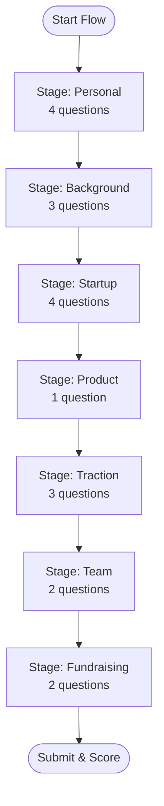
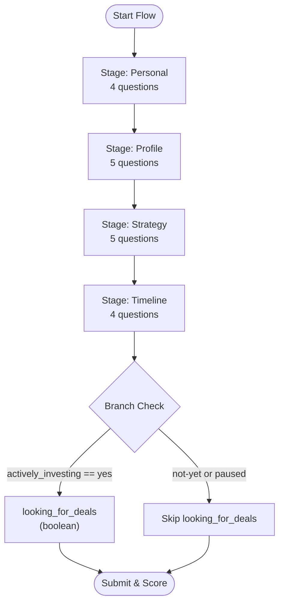
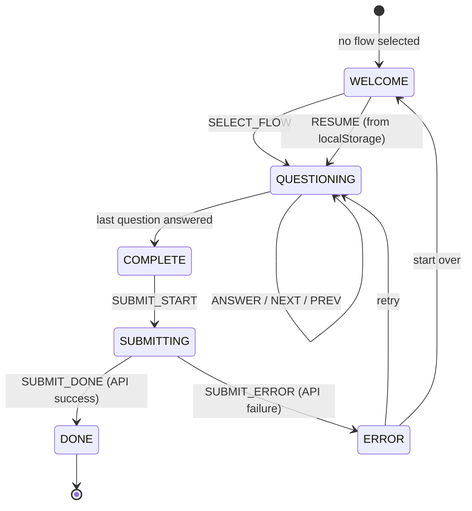
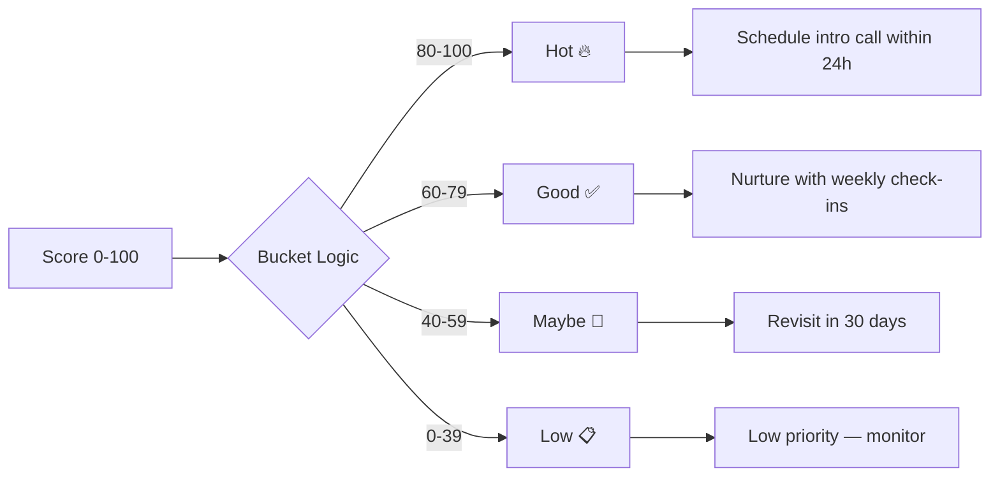

# Conversation Flow

## Founder Flow — 18 Questions Across 7 Stages



### Stage: Personal

```
 1. full_name        │ text      │ "What is your full name?"
    └─ validation: minLength 2

 2. email            │ email     │ "What is your email address?"
    └─ validation: regex ^[^\s@]+@[^\s@]+\.[^\s@]+$

 3. phone            │ tel       │ "What is your phone number?"
    └─ validation: regex ^\+?[\d\s\-()]{7,20}$

 4. linkedin         │ url       │ "What is your LinkedIn profile URL?"
    └─ validation: must include "linkedin.com"
```

### Stage: Background

```
 5. prev_startup          │ select    │ "Have you started a company before?"
    └─ options: yes, no

 6. industry_experience   │ number    │ "How many years of industry experience?"
    └─ validation: min 0, max 50

 7. commitment            │ select    │ "Full-time or part-time?"
    └─ options: full-time, part-time
```

### Stage: Startup

```
 8. startup_name         │ text      │ "What is your startup called?"
 9. industry             │ select    │ "Which industry are you in?"
    └─ options: fintech, health, saas, ai-ml, climate, edtech, ecommerce, other

10. problem_statement    │ textarea  │ "What problem are you solving?"
    └─ validation: minLength 50

11. target_customer     │ text      │ "Who is your target customer?"
```

### Stage: Product

```
12. mvp_status     │ select    │ "What is your current MVP status?"
    └─ options: idea, prototype, mvp, launched, revenue
```

### Stage: Traction

```
13. active_users       │ number    │ "How many active users/customers?"
    └─ validation: min 0

14. monthly_revenue    │ number    │ "Monthly revenue (USD)?"
    └─ validation: min 0

15. growth_rate        │ number    │ "Month-over-month growth rate (%)?"
    └─ validation: min 0, max 100
```

### Stage: Team

```
16. team_size       │ number    │ "How many people on your team?"
    └─ validation: min 1

17. has_cofounder   │ select    │ "Do you have a co-founder?"
    └─ options: yes, no
```

### Stage: Fundraising

```
18. funding_ask    │ number    │ "How much funding are you raising (USD)?"
    └─ validation: min 0

19. pitch_deck     │ file      │ "Upload your pitch deck"
    └─ validation: PDF only, max 10MB
```

---

## Investor Flow — 17 Questions Across 4 Stages



### Stage: Personal

```
 1. full_name    │ text    │ "What is your full name?"
 2. email        │ email   │ "What is your email address?"
 3. phone        │ tel     │ "What is your phone number?"
 4. linkedin     │ url     │ "What is your LinkedIn profile URL?"
```

### Stage: Profile

```
 5. investor_type       │ select      │ "What type of investor are you?"
    └─ options: angel, vc, family-office, corporate

 6. preferred_stage     │ select      │ "What stage do you typically invest in?"
    └─ options: pre-seed, seed, series-a, series-b-plus

 7. sector_focus        │ multiselect │ "Which sectors are you focused on?"
    └─ options: fintech, health, saas, ai-ml, climate, edtech, ecommerce, other

 8. cheque_min          │ number      │ "Minimum cheque size (USD)?"
    └─ validation: min 0

 9. cheque_max          │ number      │ "Maximum cheque size (USD)?"
    └─ validation: min 0
```

### Stage: Strategy

```
10. deployment_timeline   │ select    │ "Typical deployment timeline?"
    └─ options: 0-3, 3-6, 6-12, 12-plus (months)

11. portfolio_count       │ number    │ "Companies in current portfolio?"
    └─ validation: min 0

12. geography             │ select    │ "Preferred geography?"
    └─ options: north-america, europe, asia, global

13. follow_on_strategy    │ textarea  │ "Follow-on investment strategy?"
    └─ validation: minLength 50

14. value_add             │ textarea  │ "How do you add value to portfolio?"
    └─ validation: minLength 50
```

### Stage: Timeline

```
15. decision_timeline      │ select   │ "How quickly do you make decisions?"
    └─ options: 1-2, 2-4, 4-8, 8-plus (weeks)

16. actively_investing     │ select   │ "Are you actively investing right now?"
    └─ options: yes, not-yet, paused
    └─ BRANCH: if "not-yet" or "paused" → skip question 17

17. looking_for_deals      │ boolean  │ "Currently looking for new deals?"
    └─ hidden if actively_investing is "not-yet" or "paused"

18. investment_thesis      │ file     │ "Upload your investment thesis"
    └─ validation: PDF only, max 10MB
```

---

## Branching Rules

### Founder Flow
No branching — all 18 questions are always presented.

### Investor Flow
| Trigger Question | Condition | Skipped Question(s) |
|---|---|---|
| `actively_investing` | value is `"not-yet"` or `"paused"` | `looking_for_deals` (boolean) |

Branching is evaluated reactively — the question list is rebuilt on every answer so that skip rules apply dynamically as the user progresses.

---

## State Machine



### State Transitions

| Action | Effect |
|---|---|
| `SELECT_FLOW` | Initializes flow type, generates session ID, builds question list |
| `ANSWER` | Stores answer value, re-evaluates branching (rebuilds question list) |
| `NEXT` | Advances to next unanswered question; if last → marks complete |
| `PREV` | Goes back one question |
| `RESUME` | Restores full state from localStorage |
| `SUBMIT_START` | Sets submitting flag, triggers API call |
| `SUBMIT_DONE` | Marks complete with timestamp, clears session storage |
| `SUBMIT_ERROR` | Stores error message for retry UI |
| `RESET` | Clears all state, returns to welcome |

### Persistence
- Session auto-saves to localStorage (`venturizer_qualification_session`) with 300ms debounce
- On page load, existing session auto-restores
- Cleared on successful submission or explicit reset

---

## Scoring Buckets

The final score is a Hybrid score combining the Rule-Based engine (80%) and the Groq AI Analyst evaluation (20%).



## Input Types

| Type | Component | Visual |
|---|---|---|
| `text` | TextInput | Single line, bottom-border only |
| `email` | EmailInput | Text + email validation |
| `tel` | PhoneInput | Text + phone regex |
| `url` | UrlInput | Text + URL parse + domain check |
| `number` | NumberInput | Number (hides spinners) |
| `select` | SelectInput | Native `<select>` with chevron |
| `multiselect` | MultiSelectInput | Toggle pill buttons (rounded-full) |
| `textarea` | TextAreaInput | Multi-line, min-height 120px |
| `boolean` | BooleanInput | Two radio buttons (Yes/No), rounded-xl |
| `file` | FileUploadInput | Drag-drop zone, progress bar, PDF-only |
