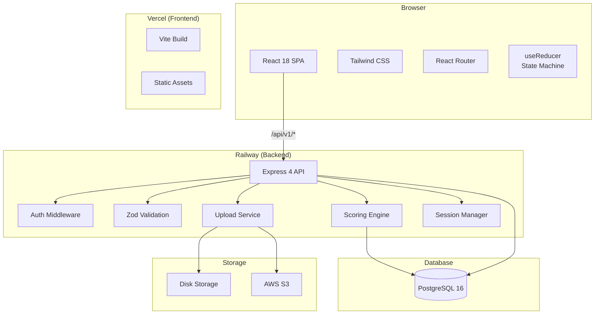
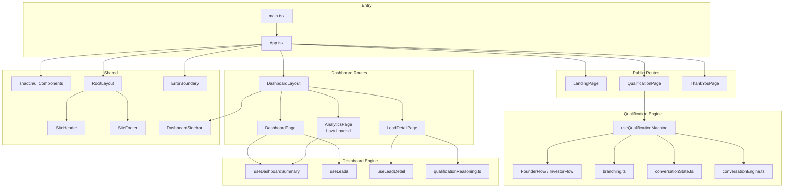
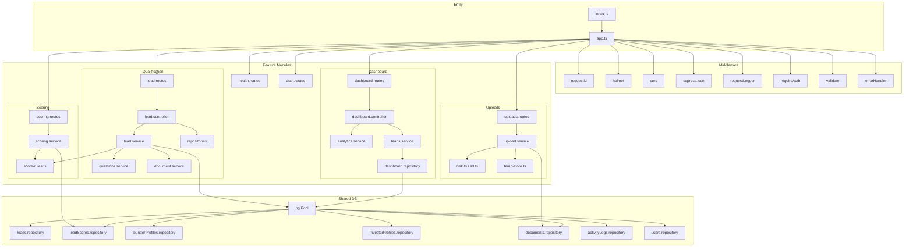
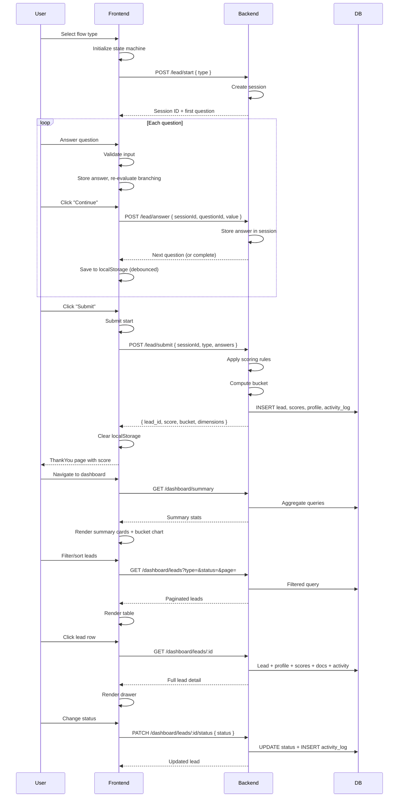

# Architecture

## System Overview

## Frontend Architecture

### Frontend Layers

**1. Routing Layer** (`App.tsx`)
- React Router v6 with `BrowserRouter`
- Dashboard routes wrapped in `DashboardLayout` (sidebar + header)
- Analytics route is lazy-loaded with `React.lazy` + `Suspense` to keep recharts out of main bundle

**2. State Layer** (`useQualificationMachine`)
- Single `useReducer` hook manages all qualification state
- Actions: `SELECT_FLOW`, `ANSWER`, `NEXT`, `PREV`, `RESUME`, `SUBMIT_START`, `SUBMIT_DONE`, `SUBMIT_ERROR`, `RESET`
- Session persisted to `localStorage` with 300ms debounce
- Branching re-evaluated on every answer by rebuilding the question list

**3. Data Layer** (Dashboard hooks)
- `useDashboardSummary` — fetches aggregate stats
- `useLeads` — paginated lead list with filters and `AbortController` for cancellation
- `useLeadDetail` — full lead profile with scores, documents, activity

**4. Component Layer**
- Qualification: `WelcomeScreen`, `ConversationContainer`, `QuestionCard`, `QuestionRenderer`, `ProgressBar`, `NavigationButtons`, 10 input components
- Dashboard: `SummaryCards`, `QualificationBreakdown`, `DashboardFilters`, `LeadTable`, `LeadDrawer`, `Pagination`, `PdfViewer`, `StatsGrid`, `TrendChart`, `BucketChart`

**5. Styling Layer**
- Tailwind CSS 3 with CSS variables for theme tokens
- Monochrome palette (near-black foreground, white background) with red accent
- Inter font with optical sizing
- `prefers-reduced-motion` support disables all animations

---

## Backend Architecture

### Backend Layers

**1. Middleware Stack** (applied in order)
1. `requestId` — attaches unique UUID to every request
2. `helmet` — security headers (CSP, X-Frame-Options, etc.)
3. `cors` — configurable origin, methods, headers
4. `express.json` (1MB limit) + `express.urlencoded`
5. `requestLogger` — logs method, path, status, duration
6. Route-specific: `requireAuth` + `validate(schema)` + `asyncHandler`
7. `notFound` — 404 catch-all
8. `errorHandler` — centralized error formatting

**2. Feature Modules** (feature-first structure)
- Each feature has its own routes, controllers, services, and validation
- Shared DB repositories are used across features
- Scoring engine is standalone with pure functions

**3. Data Access Layer** (shared/repositories)
- Raw SQL via `pg` pool with parameterized queries (no ORM)
- Base repository provides `paginatedQuery`, `findOne`, `insertOne`
- Feature-specific repositories for leads, scores, profiles, documents, activity logs, users

**4. Scoring Engine**
- Pure function: `calculate(answers, type) → ScoreOutput`
- 7 founder dimensions + 6 investor dimensions
- Each dimension has an `evaluator(answer)` pure function
- Score capped at 100 via `Math.min(sum, 100)`

---

## Data Flow

---

## Key Design Decisions

| Decision | Rationale |
|---|---|
| **No chatbot UI** | Clean form-based flow avoids generic chatbot aesthetic and is more familiar for venture capital context |
| **No LLM dependency** | Deterministic rule-based scoring is faster, cheaper, and auditable — no API latency or cost per evaluation |
| **useReducer over Redux/Zustand** | Single-question-at-a-time flow doesn't need global state management; simple reducer is sufficient |
| **Code-split analytics** | Recharts is 420KB — lazy loading keeps main bundle under 300KB gzipped |
| **Raw SQL over ORM** | Full control over query performance, especially for dashboard aggregation queries |
| **In-memory sessions** | Qualification sessions expire after 2 hours — avoids DB writes for in-progress sessions |
| **Debounced localStorage** | 300ms debounce prevents layout jank from rapid serialization during fast answering |
| **Branching rebuilds question list** | Simple approach — rebuild filtered list on every answer rather than complex tree traversal |
| **API key over JWT** | Sufficient for internal team tool with handful of users — no token refresh flow needed |
| **CSS variables for theme** | Allows runtime theme switching (future dark mode) without rebuilding CSS |
